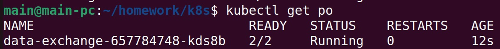
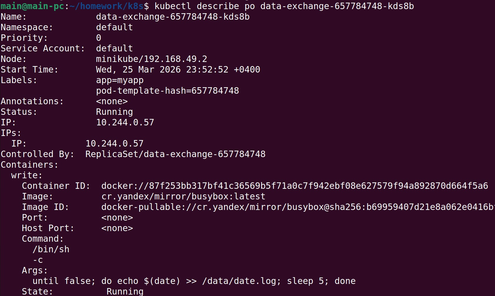
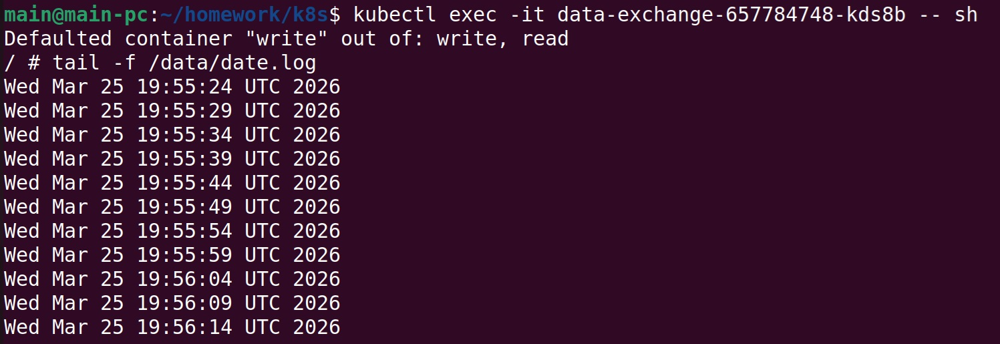
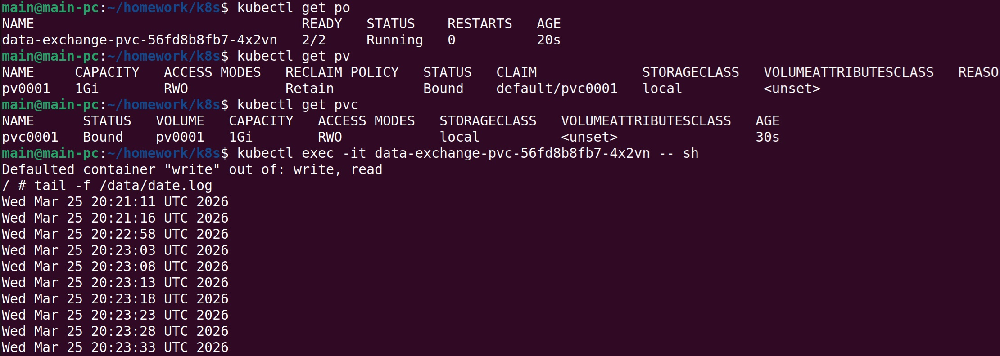
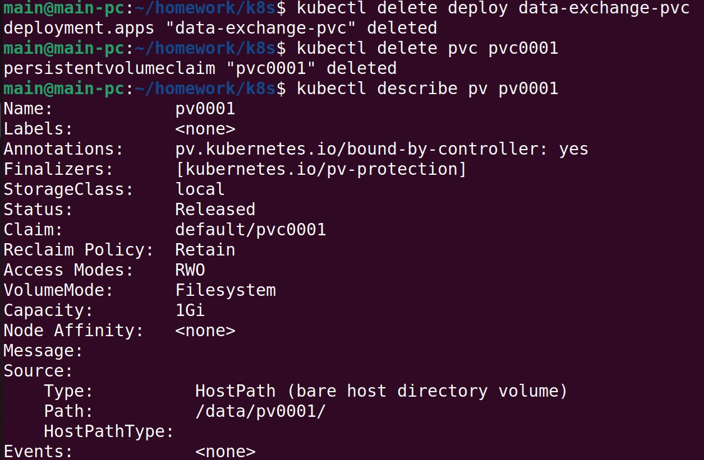
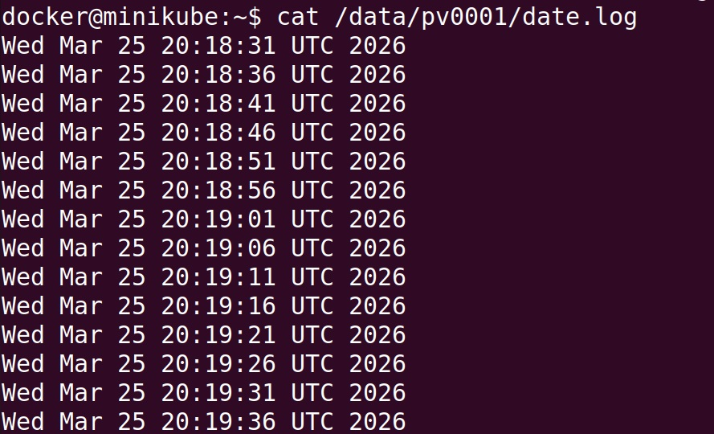
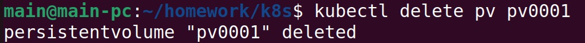
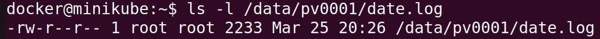
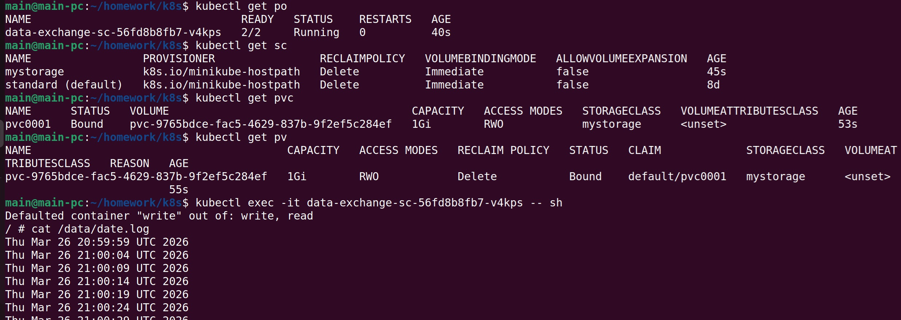

## Решение задания 1

Создание Deployment приложения, состоящего из двух контейнеров, обменивающихся данными:
https://github.com/cranberry511/kuber-homeworks_2.1/blob/main/containers-data-exchange.yaml

Описание пода с контейнерами:  

Вывод команды чтения файла:

## Решение задания 2

Создание Deployment приложения, использующего локальный PV, созданного вручную:
https://github.com/cranberry511/kuber-homeworks_2.1/blob/main/pv-pvc.yaml

Удаление Deployment и PVC:

Убеждаемся, что файл сохранился на локальном диске ноды:

Данное поведение объясняется значением параметра persistentVolumeReclaimPolicy: Retain, содержимое тома сохраняется после удаления PVC и Deployment, статус меняется на Released

Удаление PV:

Проверяем, что произошло с файлом после удаления PV:

Файл остался также из-за параметра persistentVolumeReclaimPolicy: Retain

## Решение задания 3

Создание Deployment приложения, использующего PVC, созданный на основе StorageClass:
https://github.com/cranberry511/kuber-homeworks_2.1/blob/main/sc.yaml
